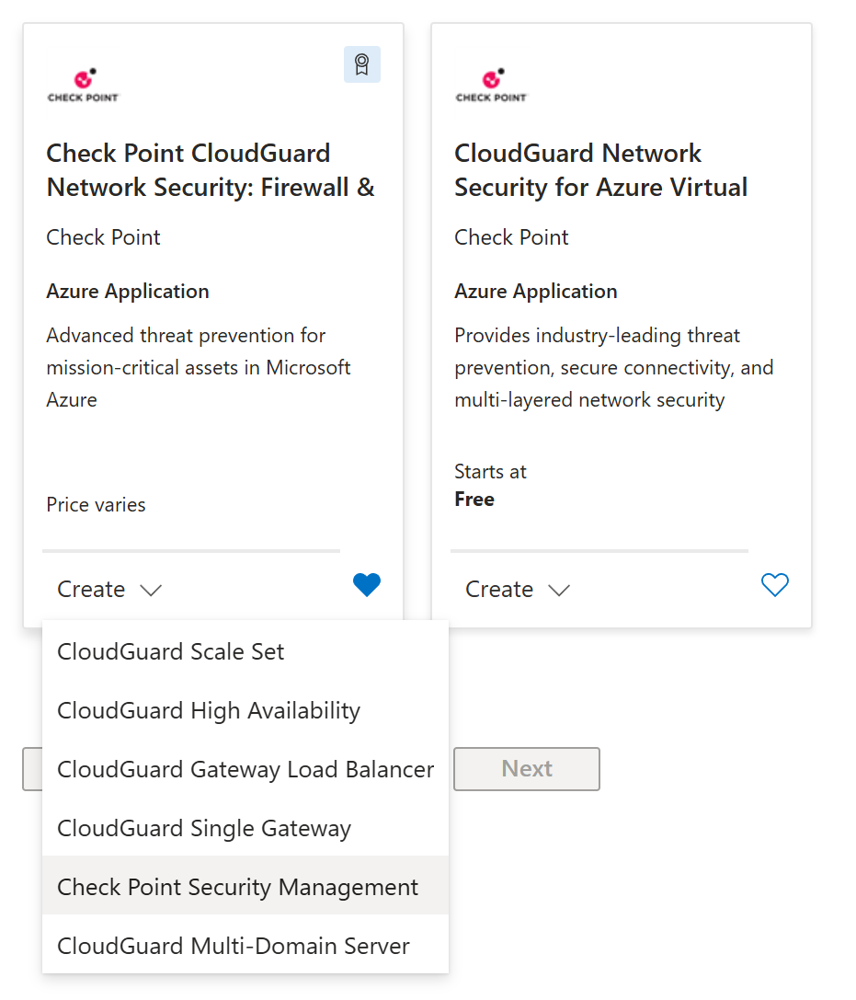

# `make managent` 
# using Terraform module
---
---
# `make management` using Terraform module

* sss

---
layout: two-cols-header
---
# Clickops approach from Azure Marketplace
::left::

::right::

---
---
# DevOps approach - declarative in code

```hcl
module "example_module" {

    source  = "CheckPointSW/cloudguard-network-security/azure//modules/management_new_vnet"
    version = "1.0.4"


    source_image_vhd_uri            = "noCustomUri"
    resource_group_name             = "checkpoint-mgmt-terraform"
    mgmt_name                       = "checkpoint-mgmt-terraform"
    location                        = "eastus"
    vnet_name                       = "checkpoint-mgmt-vnet"
    address_space                   = "10.0.0.0/16"
    subnet_prefix                   = "10.0.0.0/24"
    management_GUI_client_network   = "0.0.0.0/0"
    mgmt_enable_api                 = "disable"
    admin_password                  = "xxxxxxxxxxxx"
    vm_size                         = "Standard_D3_v2"
    disk_size                       = "110"
    vm_os_sku                       = "mgmt-byol"
    vm_os_offer                     = "check-point-cg-r8110"
    os_version                      = "R8110"
    bootstrap_script                = "touch /home/admin/bootstrap.txt; echo 'hello_world' > /home/admin/bootstrap.txt"
    allow_upload_download           = true
    authentication_type             = "Password"
    admin_shell                     = "/etc/cli.sh"
    serial_console_password_hash    = "xxxxxxxxxxxxxxxxxxxxxxxxxxxxxxxxxx"
    maintenance_mode_password_hash  = "xxxxxxxxxxxxxxxxxxxxxxxxxxxxxxxxxx"
    nsg_id                          = ""
    add_storage_account_ip_rules    = false
    storage_account_additional_ips  = []
}
```

---
---

# Dedicated user for Check Point Management automation

```shell
# on Security Management server
make cpman-ssh

# add admin user devops with API key
mgmt_cli -r true add administrator \
	name "devops" authentication-method "api key" \
	permissions-profile "read write all" \
	--domain 'System Data' --format json

# check user
mgmt_cli -r true show administrator name "devops" --domain 'System Data' --format json 

# fetch new API key
API_KEY=$(mgmt_cli -r true add api-key admin-name "devops"  --domain 'System Data' --format json | jq -r '."api-key"')
echo $API_KEY
```
---
---

# API key use and active sessions

```shell
# still on Security Management server with valid env var API_KEY
echo $API_KEY
# validate API key
mgmt_cli show version --format json --api-key "$API_KEY"

# api exposure check
mgmt_cli show api-settings --format json --api-key "$API_KEY" --domain 'System Data' 

# api log
tail -f $FWDIR/log/api.elg

# or via API access from curl
PAYLOAD=$(jq -n --arg apikey "$API_KEY" '{"api-key": $apikey, "read-only": true}')
RESP=$(curl_cli -s -m 5 -k "https://127.0.0.1/web_api/login" -H 'Content-Type: application/json' --data "$PAYLOAD")
echo $RESP
SID=$(echo "$RESP" | jq -r '.sid')

# show sessions
mgmt_cli show sessions details-level full --format json --api-key "$API_KEY" | jq -r '.objects[] | [.uid, .state, ."ip-address", ."user-name", .application, .locks, .changes] | @csv'

# logout
curl_cli -s -m 5 -k "https://127.0.0.1/web_api/logout" -H 'Content-Type: application/json' -H "x-chkp-sid: $SID"  --data "{}"

# show sessions again
mgmt_cli show sessions details-level full --format json --api-key "$API_KEY" | jq -r '.objects[] | [.uid, .state, ."ip-address", ."user-name", .application, .locks, .changes] | @csv'

# delete user devops
mgmt_cli -r true delete administrator name "devops" --domain 'System Data' --format json
```
---